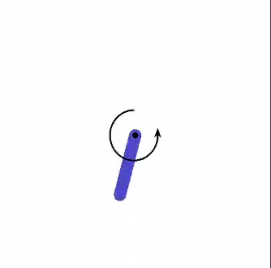

# Deep Deterministic Policy Gradients

A pluggable implementation of DDPG (off policy continuous control)
  
You can plug in your own models for the policy and value (keras model interface), any environment (gym environment), along with custom processes that have to be triggered after each episode (in the form of a callable object), optimizers, replay memory objects (where sampling and insertion can be cutom defined in any way)



An example:

```python
# pi, q, tpi and tq are the main and target policy and value nets
pi_optimizer = keras.optimizers.Adam(0.001)
q_optimizer = keras.optimizers.Adam(0.002)
replay_memory = ReplayQueue(MAX_BUFFER_SIZE)
class Trig:
	def __init__(self):
		self.cnt = 0
		self.pi = pi
		self.test_env = gym.make('Pendulum-v0')

	def __call__(self):
		self.cnt += 1
		state = self.test_env.reset()
		self.test_env.render()
		done = False
		treward = 0
		while not done:
			action = pi(np.asarray(state).reshape([1, -1]))
			state, reward, done, indo = self.test_env.step(action[0].numpy())
			self.test_env.render()
			treward += reward	
		print('Episode', self.cnt, 'Total Reward', treward)
trigger = Trig()
ddpg = DDPG(pi, q, tpi, tq, pi_optimizer, q_optimizer, env, replay_memory, GAMMA, RHO, SIGMA, 64, 4098, trigger)

while trigger.cnt < 200:
	ddpg.step()
```

This class object will do eveything from initializing the replay buffer, sampling from it, to carrying out policy iteration

The replay buffer can be used as defined in the replay_buffer.py file or custom written, by inheriting from the ReplayMemory class in the same file.
